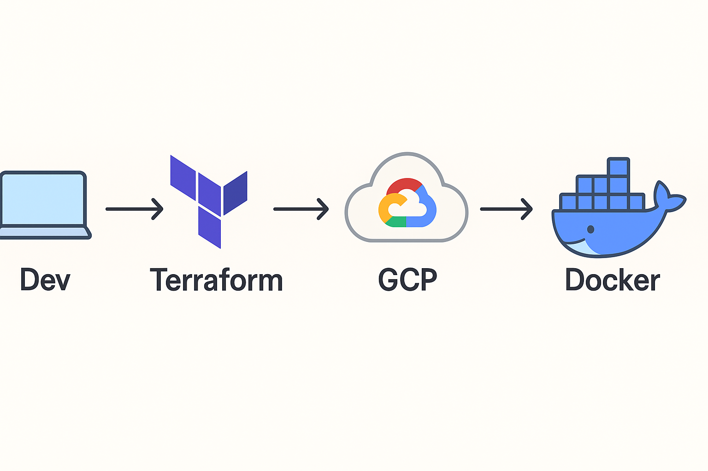

# 🌩️ CloudLab Starter 🚀


**CloudLab Starter** est un mini-lab DevOps pour apprendre à déployer une application sur Google Cloud avec **Terraform** et **Docker** — sans prise de tête.

## 📘 Sommaire
- [Workflow général](#-workflow-général)
- [Objectifs](#-objectifs)
- [Contenu](#-contenu)
- [Prérequis](#-prérequis)
- [Étapes rapides](#-étapes-rapides)
- [Aller plus loin avec CloudLab Pro](#-tu-veux-aller-plus-loin-)


## 🧭 Workflow général



## 🚀 Objectifs

- Découvrir les bases du déploiement cloud.
- Créer une VM sur GCP avec Terraform.
- Builder et exécuter une app Docker simple.
- Poser les fondations de ton futur pipeline DevOps.

---

## 📦 Contenu

```
cloudlab-starter/
├── 01_infrastructure/ # Terraform (réseau + VM)
├── 02_application/ # App + Dockerfile
└── guide/ # Documentation d’installation
```

---

## ⚙️ Prérequis

- Compte Google Cloud (avec projet actif)
- Terraform ≥ 1.3
- Docker installé localement

---

## 🧭 Étapes rapides

```bash
# 1️⃣ Clone le repo
git clone https://github.com/vanessakovalsky/cloudlab-starter.git
cd cloudlab-starter

# 2️⃣ Crée ton infrastructure
cd 01_infrastructure
terraform init
terraform apply

# 3️⃣ Build et lance l'app
cd ../02_application
docker build -t cloudlab-app .
docker run -p 8080:8080 cloudlab-app
```

## 🌟 Tu veux aller plus loin ?

La version complète CloudLab Pro inclut :

* Kubernetes (GKE)

* CI/CD GitLab automatisé

* Monitoring basique

* Guide PDF complet (30 pages)

💡 Passe à **[CloudLab Pro](#)**  
et déploie automatiquement ton app sur GKE avec **CI/CD GitLab**.  
> Inclut Kubernetes, pipeline complet, guide PDF (30 pages) et mises à jour gratuites.

🪪 Licence

MIT © 2025 — vanessakovalsky
